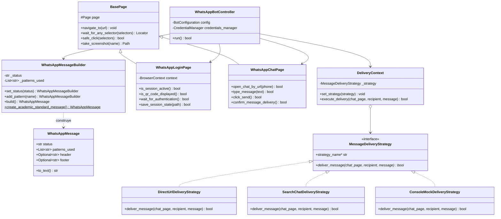
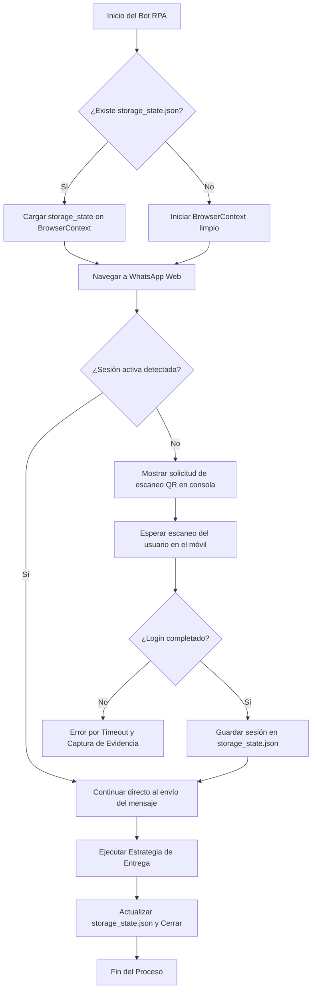

# Taller de RPA — Asignación 2: Bot de WhatsApp Web con Playwright

**Universidad de Carabobo**  
*Facultad de Ciencias y Tecnología — Departamento de Computación*  
*Sistemas de Información — Taller de Automatización Robótica de Procesos (RPA)*  
**Autor:** Brayan Ceballos  

---

## 1. Descripción del Proyecto

Este proyecto consiste en un **Bot de Automatización Robótica de Procesos (RPA)** desarrollado en **Python** utilizando **Playwright**. Su objetivo académico es interactuar de manera automatizada con la interfaz de **WhatsApp Web** para despachar un mensaje notificando la culminación de la asignación y detallando los patrones de diseño de software implementados en su arquitectura:

```text
Tarea finalizada.
Patrones utilizados: Builder, Page Object Model, Strategy.
```

El bot incorpora mecanismos de **persistencia de sesión** mediante `storage_state`, gestión segura de credenciales con la librería `keyring`, gestión de dependencias con **PDM**, empaquetado para ejecución en Windows mediante scripts `.bat`, y una suite de pruebas unitarias con **pytest**.

---

## 2. Patrones de Diseño Implementados

Para garantizar una solución escalable, desacoplada, mantenible y con alta cohesión, se implementaron tres patrones fundamentales de la ingeniería de software:



### 2.1. Builder (Patrón Creacional)
* **Propósito:** Separar la construcción de un objeto complejo (el mensaje y la configuración de ejecución) de su representación final, permitiendo que el mismo proceso de construcción cree diferentes representaciones.
* **Ubicación:** `src/whatsapp_bot/patterns/builder/`
  * `WhatsAppMessageBuilder`: Expone una interfaz fluida (*fluent interface*) para agregar encabezados, estados, lista de patrones, metadatos y fechas sin acoplar la lógica de formateo.
  * `BotConfigBuilder`: Construye las opciones de ejecución (headless, slow motion, timeouts, archivos de sesión).

### 2.2. Page Object Model — POM (Patrón Estructural / Arquitectónico)
* **Propósito:** Encapsular la estructura DOM y las interacciones con la página web dentro de clases independientes. Si la interfaz de WhatsApp Web cambia de selectores, solo se modifica el Page Object correspondiente sin alterar la lógica de negocio del bot.
* **Ubicación:** `src/whatsapp_bot/patterns/pom/`
  * `BasePage`: Métodos reutilizables para esperas explícitas, selectores alternativos, capturas de pantalla y navegación tolerante a fallos.
  * `WhatsAppLoginPage`: Manejo de la pantalla de inicio, detección y espera del código QR, y exportación de tokens/cookies (`storage_state`).
  * `WhatsAppChatPage`: Interacción con el área de conversación, apertura de chat por número, inserción de texto multilínea (manejando `Shift+Enter`), activación del botón de envío y confirmación de despacho.

### 2.3. Strategy (Patrón de Comportamiento)
* **Propósito:** Definir una familia de algoritmos de entrega de mensajes, encapsular cada uno y hacerlos intercambiables en tiempo de ejecución.
* **Ubicación:** `src/whatsapp_bot/patterns/strategy/`
  * `MessageDeliveryStrategy`: Interfaz base abstracta.
  * `DirectUrlDeliveryStrategy`: Algoritmo principal mediante URL directa (`https://web.whatsapp.com/send?phone=...`).
  * `SearchChatDeliveryStrategy`: Algoritmo alternativo que utiliza la barra lateral de búsqueda para ubicar el contacto antes de redactar.
  * `ConsoleMockDeliveryStrategy`: Estrategia de simulación para pruebas en entornos CI/CD sin navegador.
  * `DeliveryContext`: Contexto que ejecuta la estrategia configurada.

---

## 3. Persistencia de Sesión con Playwright (`storage_state`)

Uno de los requerimientos críticos de la automatización es evitar la solicitud reiterada del código QR en cada ejecución.



* **Ruta de guardado:** `sessions/storage_state.json` (gestionada en `.gitignore` para salvaguardar la privacidad de las cookies de autenticación).
* **Ciclo de vida:** Al autenticarse, `WhatsAppLoginPage.save_session_state()` genera el snapshot de estado. En ejecuciones posteriores, `BrowserManager` lo inyecta automáticamente al crear el contexto.

---

## 4. Gestión Segura de Credenciales con `keyring`

Para evitar almacenar números telefónicos o parámetros confidenciales en texto plano dentro del código fuente, se utiliza la librería `keyring`.

* El número destinatario se guarda de forma encriptada en el gestor de credenciales nativo del sistema operativo (**Windows Credential Manager** / macOS Keychain / Secret Service en Linux).
* El módulo `CredentialManager` (`src/whatsapp_bot/security/credentials_manager.py`) proporciona:
  * Sanitización automática del formato telefónico internacional (ej: `+58 412-123.4567` $\rightarrow$ `584121234567`).
  * Consulta, actualización y eliminación de credenciales desde la CLI.
  * Solicitud interactiva en la primera ejecución si no existe número configurado.

---

## 5. Estructura del Proyecto

```text
├── .gitignore                      # Exclusión de sesiones, venvs y caches
├── pyproject.toml                  # Configuración del proyecto y dependencias PDM
├── pdm.lock                        # Lockfile de dependencias reproducibles
├── run_bot.bat                     # Script de ejecución para Windows (mantiene consola abierta)
├── ejecutar_bot.bat                # Alias de ejecución en español
├── main.py                         # Punto de entrada y CLI del Bot RPA
├── Tarea 2.md                      # Requerimientos académicos de la asignación
├── README.md                       # Documentación técnica y académica
├── src/
│   └── whatsapp_bot/
│       ├── __init__.py             # Inicializador del paquete
│       ├── config.py               # Constantes, rutas, timeouts y selectores DOM
│       ├── core/
│       │   ├── __init__.py
│       │   ├── browser_manager.py  # Ciclo de vida de Playwright y BrowserContext
│       │   └── bot_controller.py   # Orquestador del flujo RPA
│       ├── security/
│       │   ├── __init__.py
│       │   └── credentials_manager.py # Integración con Keyring del SO
│       ├── patterns/
│       │   ├── __init__.py
│       │   ├── builder/            # Patrón Builder
│       │   │   ├── __init__.py
│       │   │   ├── message_builder.py
│       │   │   └── bot_config_builder.py
│       │   ├── pom/                # Patrón Page Object Model
│       │   │   ├── __init__.py
│       │   │   ├── base_page.py
│       │   │   ├── login_page.py
│       │   │   └── chat_page.py
│       │   └── strategy/           # Patrón Strategy
│       │       ├── __init__.py
│       │       ├── delivery_strategy.py
│       │       ├── direct_url_strategy.py
│       │       ├── search_chat_strategy.py
│       │       ├── console_mock_strategy.py
│       │       └── strategy_factory.py
│       └── utils/
│           ├── __init__.py
│           └── logger.py           # Logger formateado y auditoría
└── tests/                          # Suite de pruebas unitarias
    ├── test_bot_config_builder.py
    ├── test_bot_controller.py
    ├── test_credentials_manager.py
    ├── test_message_builder.py
    ├── test_pom_structure.py
    └── test_strategy.py
```

---

## 6. Instalación y Puesta en Marcha

### Requisitos Previos
* **Python 3.11 o superior** (probado con Python 3.13 en Windows).
* **PDM (Python Development Master)** instalado en el sistema (`pip install pdm` o instalador oficial).

### 6.1. Instalación con PDM

1. Clonar o descargar el repositorio:
   ```bash
   git clone https://github.com/bracebalDev/workshop_rpa_2.git
   cd workshop_rpa_2
   ```

2. Instalar dependencias del proyecto:
   ```bash
   pdm install
   ```

3. Instalar los binarios del navegador Chromium para Playwright:
   ```bash
   pdm run playwright install chromium
   ```

---

## 7. Guía de Uso y Ejecución

### 7.1. Ejecución con Script por Lotes (`run_bot.bat` / `ejecutar_bot.bat`)
Haga doble clic sobre el archivo `run_bot.bat` (o `ejecutar_bot.bat`), o ejecútelo desde una terminal de comandos (CMD / PowerShell):

```cmd
run_bot.bat
```
> **Nota:** El archivo `.bat` finaliza con la instrucción `pause`, garantizando que la ventana de la consola permanezca abierta para visualizar los resultados de la ejecución.

### 7.2. Ejecución desde CLI con PDM

* **Ejecución normal (solicita número si no está guardado):**
  ```bash
  pdm run python main.py
  ```

* **Ejecutar especificando el número de teléfono destinatario:**
  ```bash
  pdm run python main.py -p 584121234567
  ```

* **Guardar permanentemente el número en el Keyring del SO:**
  ```bash
  pdm run python main.py --save-phone 584121234567
  ```

* **Consultar el número guardado en Keyring:**
  ```bash
  pdm run python main.py --show-phone
  ```

* **Eliminar el número de Keyring:**
  ```bash
  pdm run python main.py --delete-phone
  ```

* **Ejecutar en modo de prueba / simulación académica (Dry-Run sin abrir navegador):**
  ```bash
  pdm run python main.py --dry-run -p 584121234567
  ```

* **Seleccionar estrategia de entrega alternativa:**
  ```bash
  pdm run python main.py -s search_chat
  ```

---

## 8. Ejecución de Pruebas Automatizadas

El proyecto incluye 15 pruebas unitarias que validan la construcción de mensajes, persistencia de configuración, operaciones de Keyring, contratos de los Page Objects y el intercambio dinámico del patrón Strategy:

```bash
pdm run pytest -v
```

Salida esperada:
```text
tests/test_bot_config_builder.py::test_default_bot_configuration PASSED
tests/test_bot_config_builder.py::test_custom_bot_configuration PASSED
tests/test_bot_controller.py::test_bot_controller_dry_run_execution PASSED
tests/test_credentials_manager.py::test_sanitize_phone_number PASSED
tests/test_credentials_manager.py::test_invalid_phone_number_raises_error PASSED
tests/test_credentials_manager.py::test_keyring_storage_and_retrieval PASSED
tests/test_message_builder.py::test_academic_standard_message_format PASSED
tests/test_message_builder.py::test_builder_fluent_customization PASSED
tests/test_message_builder.py::test_builder_duplicate_pattern_handling PASSED
tests/test_pom_structure.py::test_base_page_delegation PASSED
tests/test_pom_structure.py::test_login_page_detection_mock PASSED
tests/test_pom_structure.py::test_chat_page_type_message_mock PASSED
tests/test_strategy.py::test_strategy_factory_instantiation PASSED
tests/test_strategy.py::test_strategy_factory_invalid_name PASSED
tests/test_strategy.py::test_delivery_context_execution_and_switching PASSED

============================= 15 passed in 0.22s =============================
```

---

## 9. Criterios de Evaluación Cumplidos

| Criterio de Evaluación | Estado | Detalle de Implementación |
| :--- | :---: | :--- |
| **Envío del mensaje con formato requerido** | Cumplido | Construido mediante `WhatsAppMessageBuilder` con el texto exacto requerido. |
| **Patrones de diseño aplicados** | Cumplido | **Builder**, **Page Object Model (POM)** y **Strategy** documentados e integrados. |
| **Persistencia de sesión (`storage_state`)** | Cumplido | Carga automática en `BrowserManager` y guardado tras autenticación en `LoginPage`. |
| **Gestión de credenciales con `keyring`** | Cumplido | `CredentialManager` integrado con el almacén seguro del sistema operativo. |
| **Gestión del proyecto con PDM** | Cumplido | Archivos `pyproject.toml` y `pdm.lock` configurados. |
| **Ejecución vía archivo `.bat` con pausa** | Cumplido | `run_bot.bat` y `ejecutar_bot.bat` operativos con `pause`. |
| **Repositorio público en GitHub** | Cumplido | Repositorio estructurado con ramas `main`, `develop` y ramas de características. |
